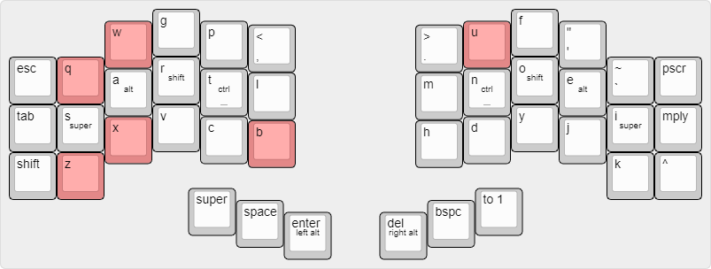

# arthurnunesc's Cantor Keymap

This is my own Cantor Keyboard Layout, developed to fit my personal use. Its design is heavily centered around providing a comfortable typing experience for those who type mainly in Portuguese and English, but also in Spanish and Catalan.

The layout takes a lot from many other layouts. Mainly [Soul](https://kennetchaz.github.io/symmetric-typing/soul.html), [Niro](https://kennetchaz.github.io/symmetric-typing/niro.html), QGMLWY and [Miryoku](https://github.com/manna-harbour/miryoku). 

]

## Observations

- It is assumed you are using the English International Layout on your OS of choice.
- This is probably the fourth version of my layout, do not expect this to be "stable". I will still tweak things as I feel necessary.

## To do

- Add image that shows every layer.
- Add key label chart.
- Add a picture of my keyboard.
